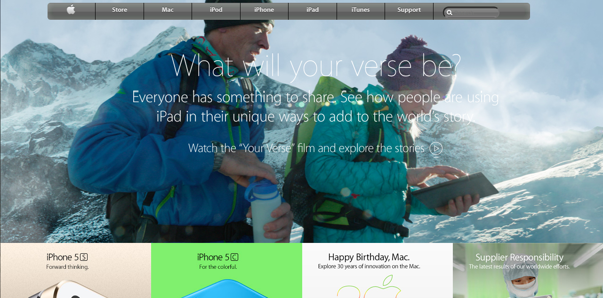

# A Clone of Apple Website

This project consists of building a a webpage using images as a background and adding gradients to elements. The goal is to make a clone of old an old version of the [Apple website](https://web.archive.org/web/20140301004610/http://www.apple.com/) webpage.

## Screenshots

## Project Description

<https://www.theodinproject.com/courses/html5-and-css3/lessons/building-with-backgrounds-and-gradients>

## Run locally

1. Clone the project- git clone <https://github.com/bafiam/apple-clone.git>
2. Cd apple-clone
3. Run index.html on your browser

## Built With

1. HTML5
2. CSS3
3. BACKGROUNDS AND GRADIENTS

## Github Pages Link

<https://bafiam.github.io/apple-clone/>

## License

This project is licensed under the MIT License - see the [LICENSE.md](LICENSE.md) file for details.

## Authors

1. [Stephen Gumba](https://github.com/bafiam)

## Acknowledgments

* Microverse.
